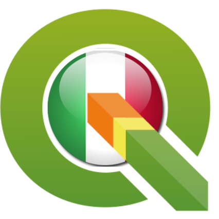

#### Proposte per il nuovo logo QGIS Italia - si vota!!!
 
questo non è Power Point
 

 
<a href="https://twitter.com/totofiandaca?lang=it" target="_blank">@totofiandaca</a>

+++

[Gruppo degli utenti italiani di QGIS](http://qgis.it/)

+++

[Pagina ufficiale di QGIS Italia](https://pigrecoinfinito.wordpress.com/)

+++

# Cosa vogliamo fare

Ci piacerebbe che decidessimo assieme per arrivare ad una scelta condivisa e partecipata del nuovo logo e rendere il processo il più trasparente possibile in modo che tutti possano contribuire alla scelta del logo stesso e creare, sulla base dello stesso, una serie di loghi minimal utilizzando varie dimensioni (in pixel) e vari colori come definiti qui:

---
# Logo attuale da cambiare

+++

## Spazi

- FB: [Facebook](https://www.facebook.com/pigreco314)
- repo: [https://github.com/pigreco/OpenData-da-riga-di-comando](https://github.com/pigreco/OpenData-da-riga-di-comando)

+++

+++

#Totò Fiandaca

---

